# Cài đặt Pfsense cơ bản

## I. Chuẩn bị

### 1. Tài file iso của pfsense [tại đây](https://www.pfsense.org/download/)

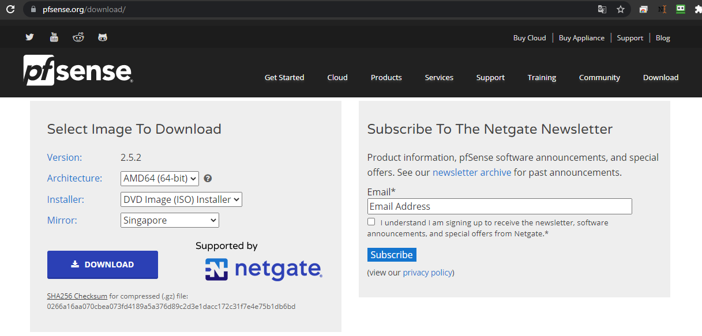

### 2. Chuẩn bị VM

- Cấu hình VM cho Pfsense:
  - CPU: 2
  - Ram: 2 GB
  - Disk: 20 GB
  - Chuẩn bị 2 Card mạng: 1 LAN có IP: 172.16.4.29 và 1 WAN có IP: 10.10.13.29

## II. Install Pfsense

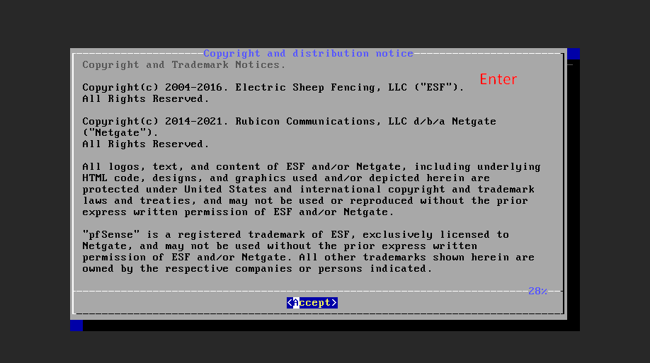

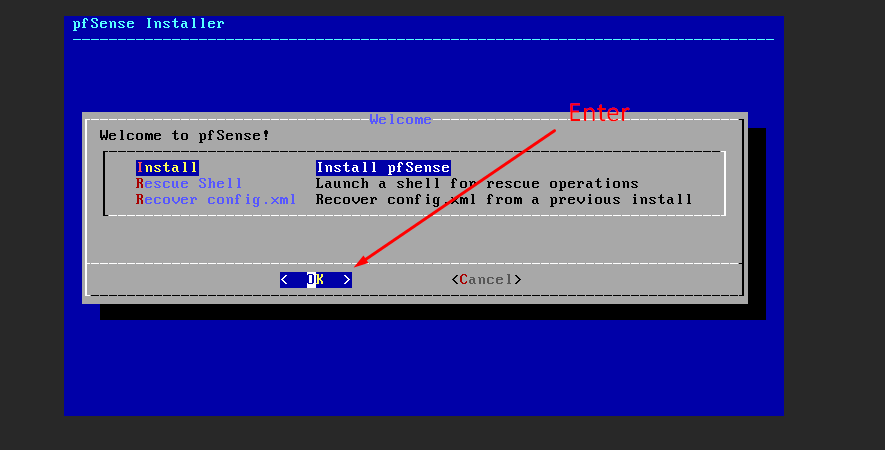

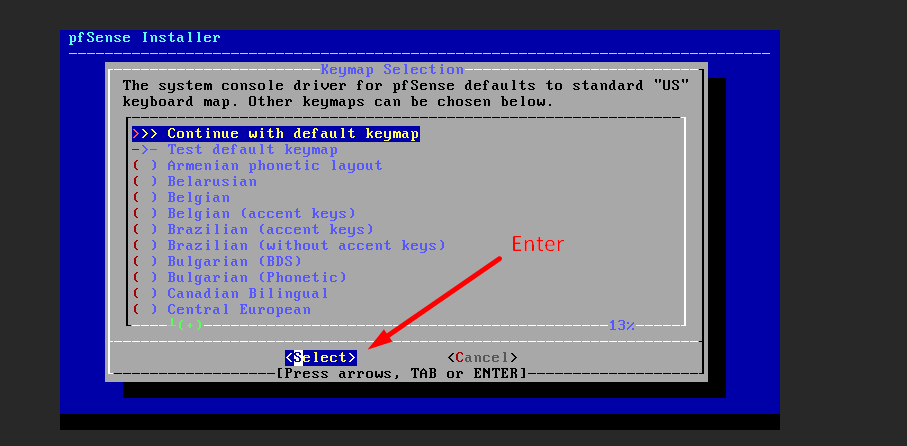

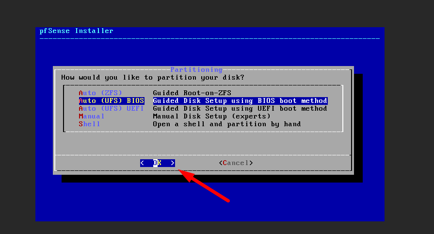


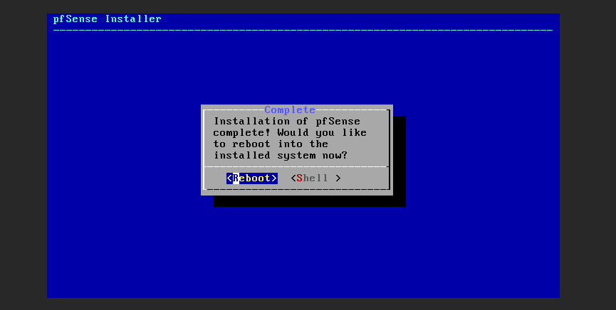
Sau khi hoàn thành các bước trên, đợi 1-2 phút để VM khởi động lại.

## Phần III. Configuare Pfsense terminal
### Bước 1: Bỏ qua thiết lập DHCP cho VLAN

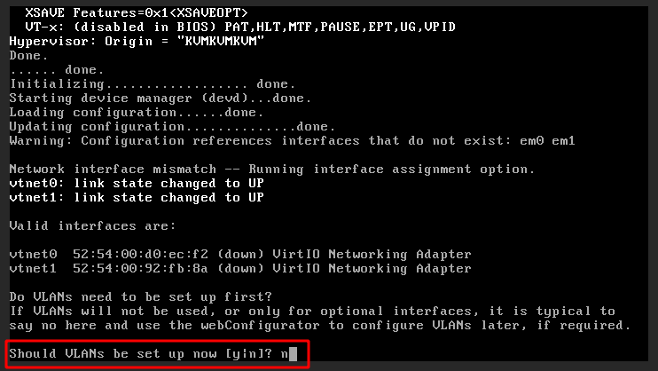

### Bước 2: Cấu hình VLAN thủ công

Bước này ta chọn cấu hình cho `vtnet0`
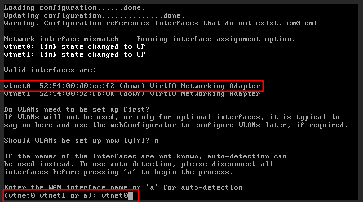

Bỏ qua bước cấu hình cho vtnet1 

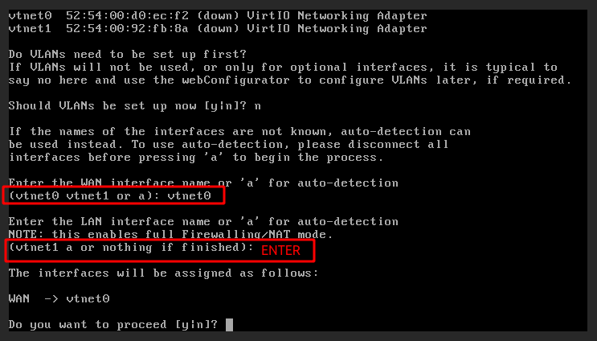

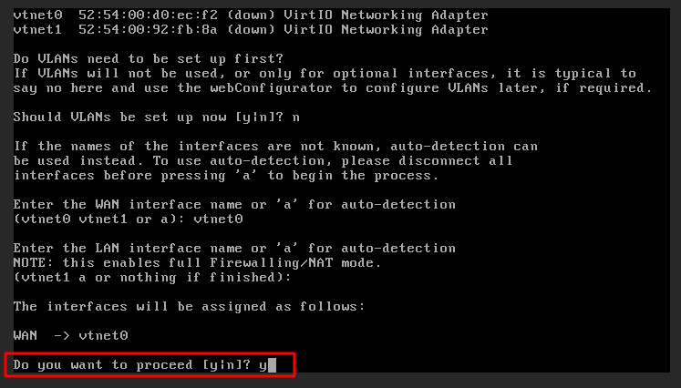
- Chờ Pfsense chạy thiết lập cấu hình cơ bản

### Bước 3: Đặt cấu hình IP tĩnh
- Sử dụng phím tùy chọn `2` để tiến hành cấu hình IP tĩnh

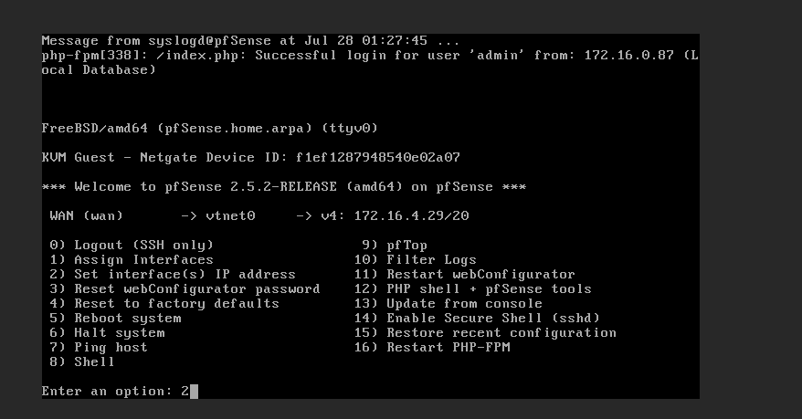

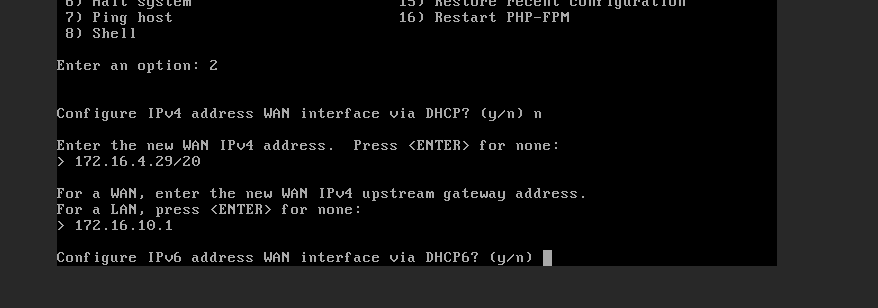

```
- Đặt IP:

> 172.16.4.29/20

- Đặt Gateway:

>172.16.10.1

```
### Bước 4: Bỏ qua Cấu hình IPv6

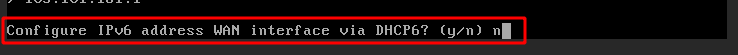

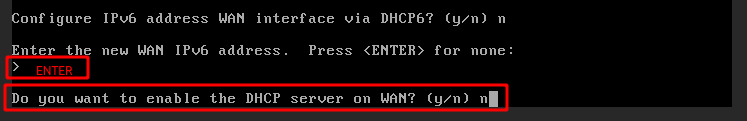

### Bước 5: Thiết lập revert to HTTP

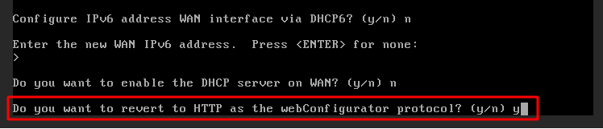

* Thông báo thiết lập cấu hình thành công
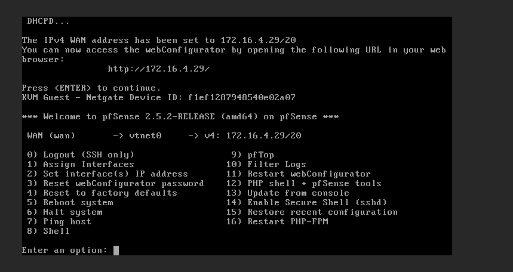

- Truy cập Pfsense : `http://172.16.4.29/` có thông tin quản trị:
  - Account: `admin`
  - Password: `pfsense`


## IV. Configuare Pfsense qua Giao diện

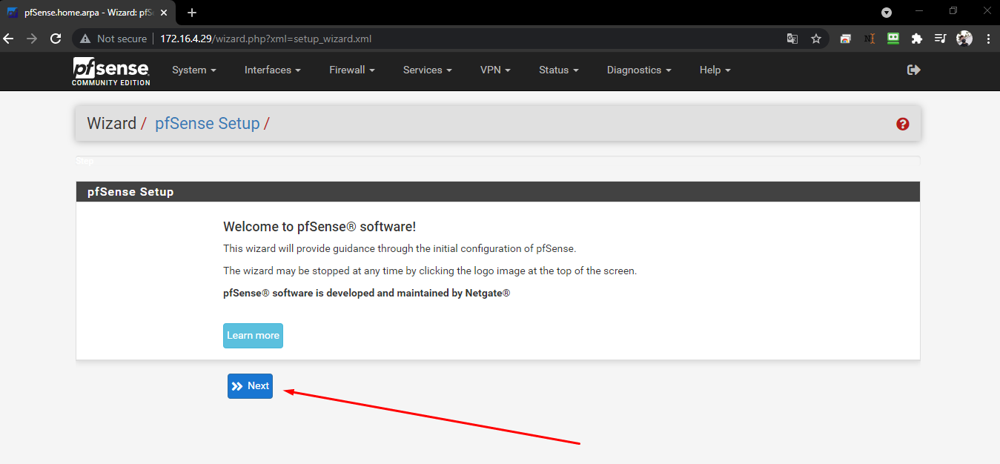

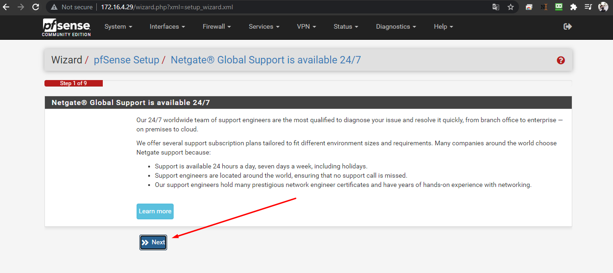

- Thiết lập DNS Google:

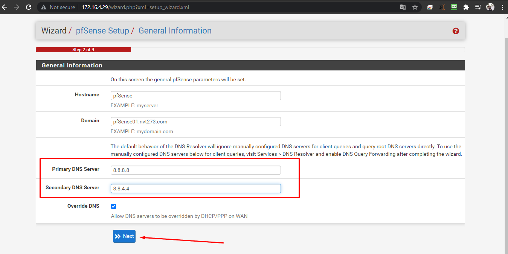

- Thiêt lập Timezone:

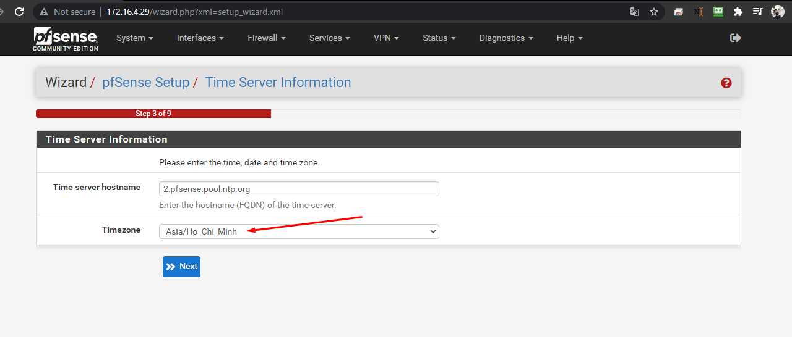

- Bấm `Next` ở phần Configure WAN Interface do đã cấu hình đặt IP ở [Bước 3 Phần II]()

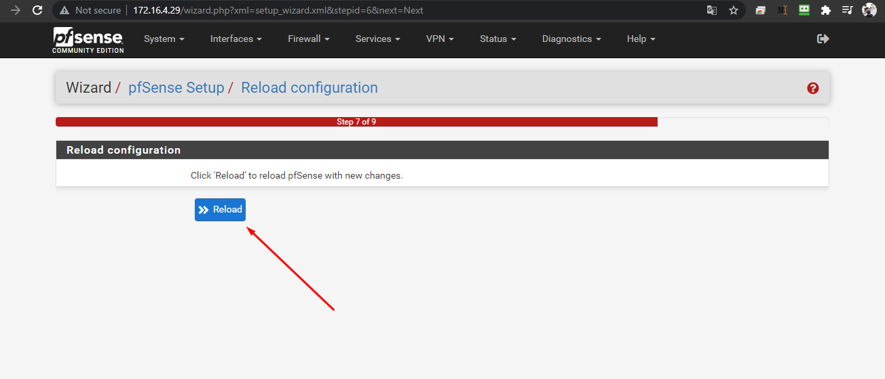
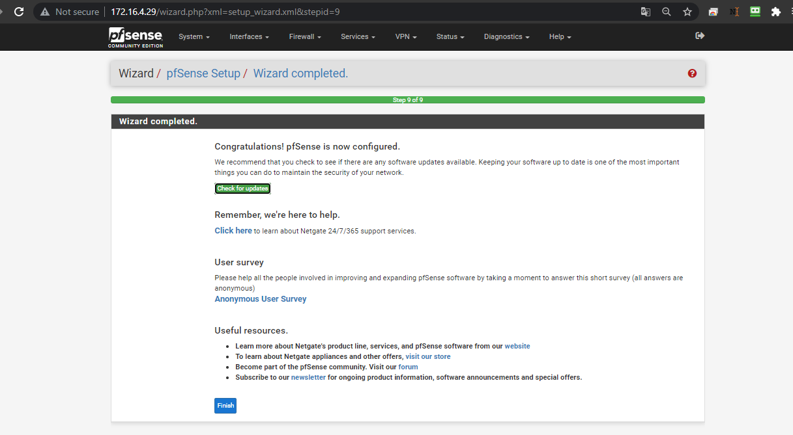
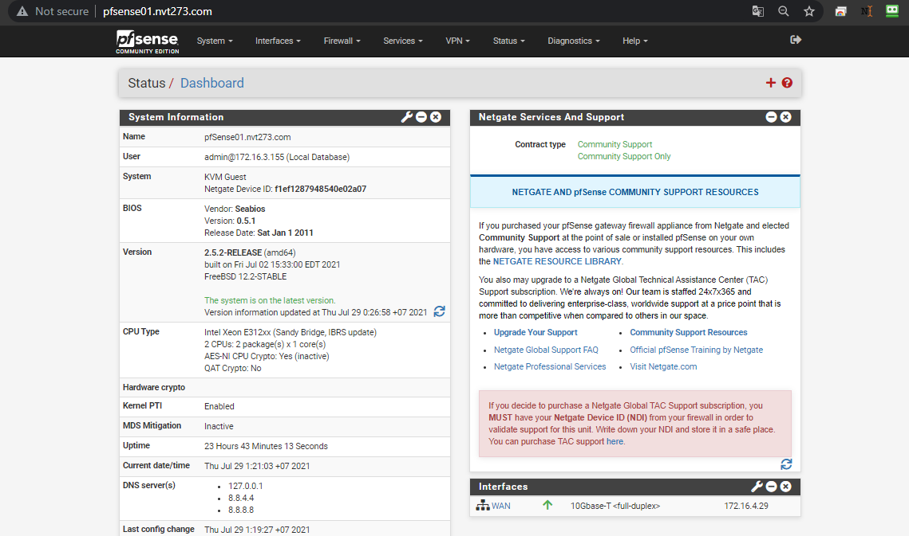
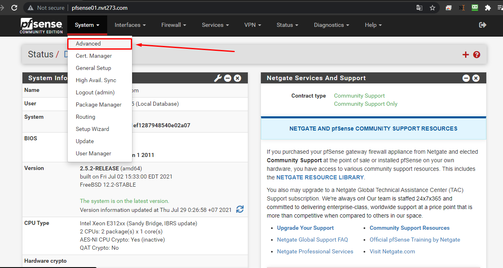
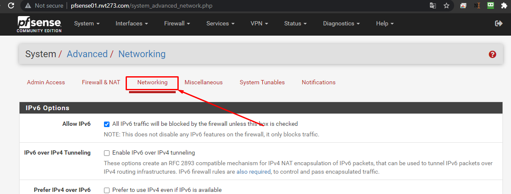
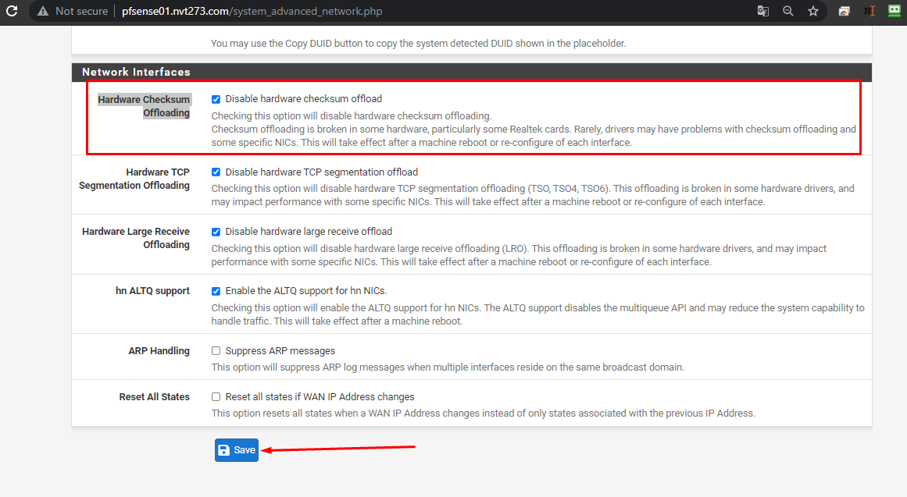


