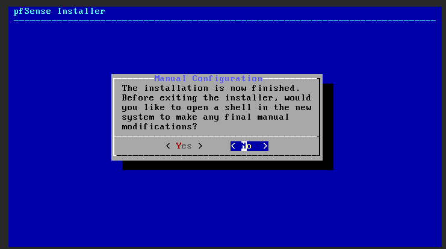
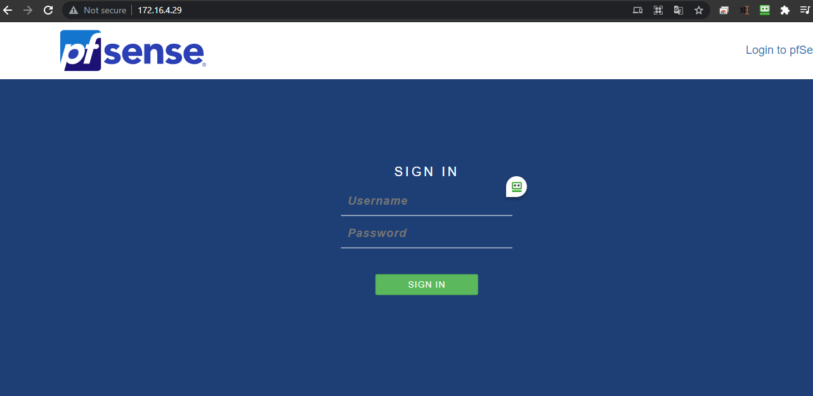
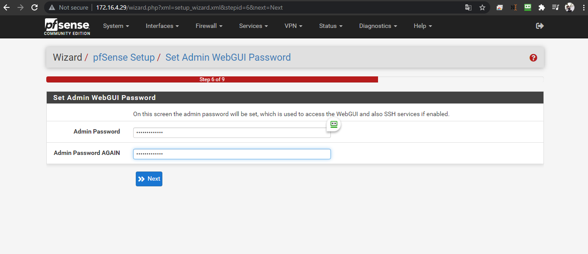

# Cài đặt Pfsense cơ bản

## I. Chuẩn bị

### 1. Tài file iso của pfsense [tại đây](https://www.pfsense.org/download/)


### 2. Chuẩn bị VM

- Cấu hình VM cho Pfsense:
  - CPU: 2
  - Ram: 2 GB
  - Disk: 20 GB
  - Chuẩn bị 2 Card mạng: 1 LAN có IP: 172.16.4.29 và 1 WAN có IP: 10.10.13.29

## II. Install Pfsense





Sau khi hoàn thành các bước trên, đợi 1-2 phút để VM khởi động lại.

## Phần III. Configuare Pfsense terminal
### Bước 1: Bỏ qua thiết lập DHCP cho VLAN


### Bước 2: Cấu hình VLAN thủ công

Bước này ta chọn cấu hình cho `vtnet0`


Bỏ qua bước cấu hình cho vtnet1 


- Chờ Pfsense chạy thiết lập cấu hình cơ bản

### Bước 3: Đặt cấu hình IP tĩnh
- Sử dụng phím tùy chọn `2` để tiến hành cấu hình IP tĩnh


```
- Đặt IP:

> 172.16.4.29/20

- Đặt Gateway:

>172.16.10.1

```
### Bước 4: Bỏ qua Cấu hình IPv6


### Bước 5: Thiết lập revert to HTTP


* Thông báo thiết lập cấu hình thành công


- Truy cập Pfsense : `http://172.16.4.29/` có thông tin quản trị:
  - Account: `admin`
  - Password: `pfsense`



## IV. Configuare Pfsense qua Giao diện


### 1. Thiết lập cơ bản ban đầu


- Thiết lập DNS Google:


- Thiêt lập Timezone:


- Kéo màn hình xuống cuối rồi bấm `Next` ở phần Configure WAN Interface do đã cấu hình đặt IP ở [Bước 3 Phần II](https://github.com/thang290298/Network/blob/main/01-VPN/01-OpenVPN/02-Lab/01-Install-Pfsense.md#b%C6%B0%E1%BB%9Bc-3-%C4%91%E1%BA%B7t-c%E1%BA%A5u-h%C3%ACnh-ip-t%C4%A9nh)

- Thay đổi mật khẩu cho tài khoản `admin`



- Reload để cập nhật lại `Pfsense`


- Hoàn thành thiết lập ban đầu:


- Giao diện màn hình Dashboard của Pfsense:


### 2. Tắt Hardware Checksum Offloading

- Truy cập `System` > `Advanced`


- Chọn `Networking` và kéo màn hình xuống phần `Network Interfaces` và `tick` chọn `Hardware Checksum Offloading` rồi bấm `save`:


### 3. Bổ sung Rule Firewall cho phép kết nối giao diện Pfsense qua IP Public

- Cho phép kết nối qua HTTP và HTTPS: `Firewall` > `Rules` > `WAN` chọn `Add`:


  - kéo xuống mục `Destination` và câu hình chọn `HTTP (80)` và lưu lại:


  - Cấu hình tương tự đối với `HTTPS (443)`


  
  - Chọn `Apply Changes` để lưu các thiết lập:


  - Chuyển kết nối dashboard mặc định Pfsense tới HTTPS:


### 4. Enable card mạng LAN


- Add card mạng `vtnet1`


  - Chọn `save` rồi chọn `Apply Change` để lưu cấu hình:


  - Kiểm tra nhận 2 IP ở màn hình `Dashboard`


### <p align="center">*--- Hoàn thành Setup PfSense ---*</p>
