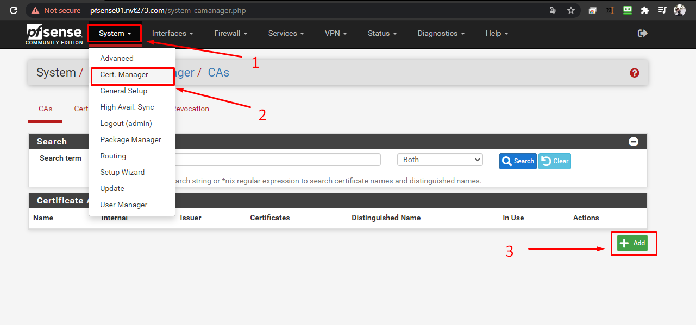
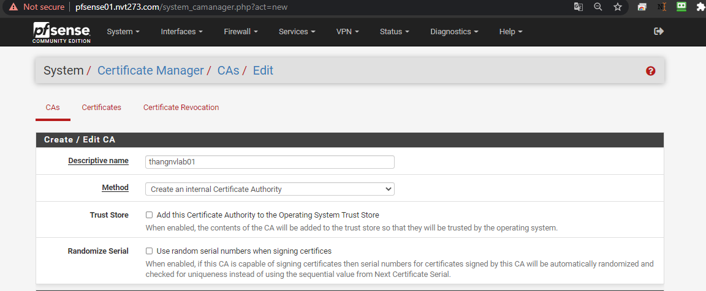
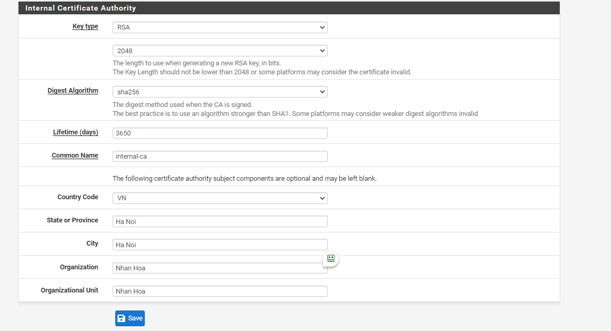

# Hướng dẫn cấu hình kết nối OpenVPN mode TAP

## Yêu cầu cấu hình Network cơ bản

```
2 Card mạng, 1 LAN, 1 WAN (Có IP Public).

Đường WAN sẽ sử dụng để Client được kết nối tới. IP WAN: 172.16.4.29

Đường LAN là đường quản trị, các Server sẽ được SSH qua dảy mạng LAN. Dải IP LAN 10.10.13.x
```

## Phần I:  Thiết lập Certificate

### 1.1 Khởi tạo CA cho OpenVPN
- CA có nhiệm vụ xác thực tất cả các Certificate trên Server VPN và user VPN khi kết nối đến Pfsense OpenVPN.

#### Bước 1: chọn `System` > `Cert. Manager` bấm `add`:



#### Bước 2: Điền thông tin Certificate

- Ở mục `Create / Edit CA` điền thông tin như sau:
   - `Descriptive name`: ca-user
   - `Method`: Create an internal Certificate Authority



- Điền đầy đủ thông tin ở mục `Internal Certificate Authority` và bấm `save`


