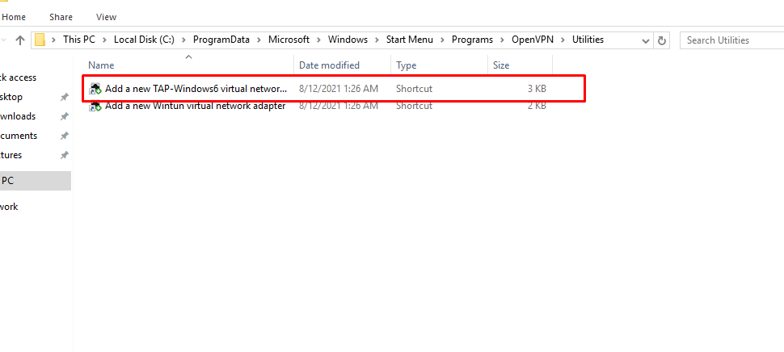
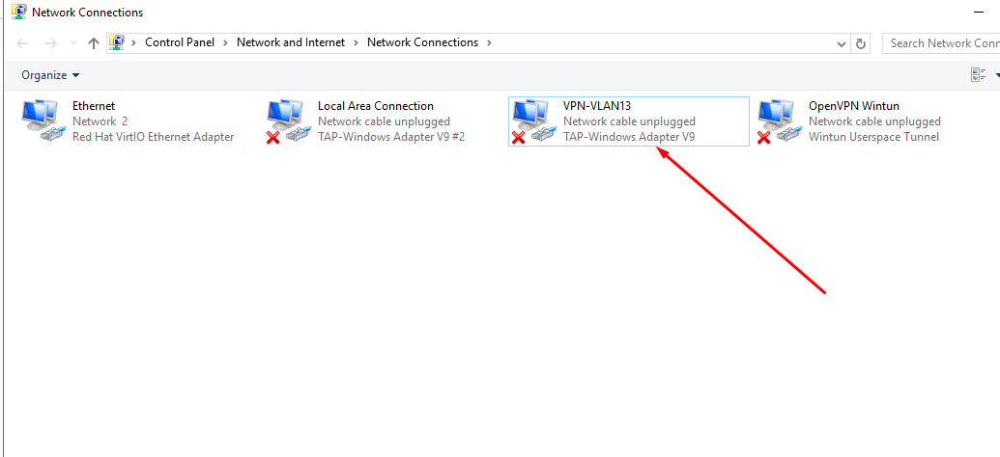
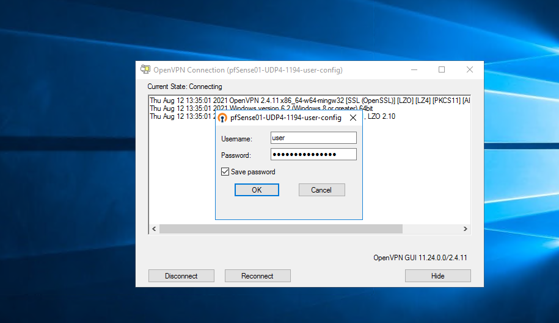
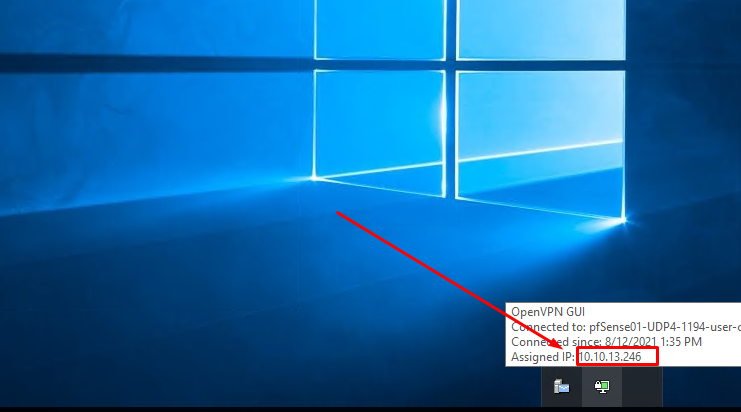
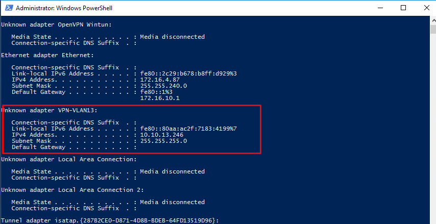
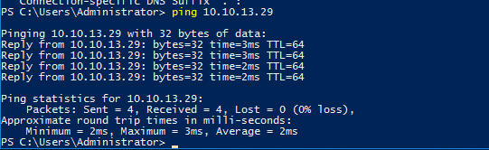

# Hướng dẫn cấu hình kết nối OpenVPN mode TAP

## Yêu cầu cấu hình Network cơ bản

```
2 Card mạng, 1 LAN, 1 WAN (Có IP Public).

Đường WAN sẽ sử dụng để Client được kết nối tới. IP WAN: 172.16.4.29

Đường LAN là đường quản trị, các Server sẽ được SSH qua dảy mạng LAN. Dải IP LAN 10.10.13.x
```
## Mô Hình 


## Phần I:  Thiết lập Certificate

### 1.1 Khởi tạo CA cho OpenVPN
- CA có nhiệm vụ xác thực tất cả các Certificate trên Server VPN và user VPN khi kết nối đến Pfsense OpenVPN.

#### Bước 1: chọn `System` > `Cert. Manager` bấm `add`:


#### Bước 2: Điền thông tin Certificate

- Ở mục `Create / Edit CA` điền thông tin như sau:
   - `Descriptive name`: ca-user
   - `Method`: Create an internal Certificate Authority


- Điền đầy đủ thông tin ở mục `Internal Certificate Authority` và bấm `save`


- Kết quả:


#### Bươc 3: tạo Certificate : ` Certificate ` > ` add `


- Tại mục: `Add/Sign a New Certificate`
  - `Method`: Create an internal Certificate
  - `Descriptive name`: ca-serer
- Tại mục: `Certificate Attributes`
  - `Certificate Type`: Server Certificate
- Sau đó bấm `save`:


## Phần II. Tạo User Client

#### Add new user cho OpenVPN
### Bước 1: Add new user
- Truy cập theo đường dẫn: `System` > `User Manager`


- chọn `add` để thêm user:


### Bước 2: điền thông tin user:


## Phần III. Cài gói Openvpn export client

### Bước 1: chọn `System > Package Manager`


### Bước 2: Chọn `Available Packages`


## Phần IV. Thiết lập OPENVPN

### Bước 1: Chọn `VPN > OpenVPNb > Add`


### Bước 2: Tạo mới server OpenVPN

#### Chọn Server:
- Tại mục `General Information`:
  - `Server mode > Remote Access ( SSL/TLS + User Auth )`
  - `Protocol > UDP on IPV4 only`
  - `Device mode > tap - Layer 2 Tap Mode`
  - `Local port: 1194`
  - `Interface: WAN` -> Sử dụng để kết nối đến mạng bên ngoài thông qua internet


- Tại mục `Cryptographic Settings`: 
  - Chọn `TLS Configuration > Use a TLS Key`
  - Chọn `TLS Configuration > Automatically generate a TLS Key`
  - Chọn `Peer Certificate Authority` > thangnvlab01 LƯU Ý: ĐÂY LÀ CERT TẠO TỪ PHẦN 1
  - Chọn `Server certificate > thangnv-server` LƯU Ý: ĐÂY LÀ CERT TẠO TỪ PHẦN 1
  - Chọn `Data Encryption Algorithms > AES-256-CBC` (256 bit key, 128 bit block)
  - Chọn `Enable NCP > Enable Negotiable Cryptographic Parameters`
  - Tại `Fallback Data Encryption Algorithm - Chọn AES-256-CBC (256bit key, 128 bit block)`


- Tunner Settings
  - Chọn `Bridge DHCP`: Tick chọn  `Allow client on the bridge to obtain DHCP`
  - `Bridge Interface: LAN`
  - Server Bridge DHCP Start: 10.10.13.20
  - Server Bridge DHCP End: 10.10.13.254
  


- `Custom Options` thêm cấu hình: `push "route 10.10.13.0 255.255.255.0"`


## Phần V. Cấu hình Interface
### 1. Cấu hình Interface VPN
#### Bước 1: Chọn `Interfaces > Assignments`


#### Bước 2: Mục `Available network ports` chọn `ovpns1 ()` tiếp theo chọn `add`


### Bước 3: Chỉnh sửa `OPT1`


- General Configuration:
  - Chọn Enable > `Enable interface`
  - Sửa  `Description: vpn`
  - Bấm `Save`


### 2. Cấu hình Bridge VPN

#### Bước 1:  Chọn `Interfaces` > `Assignments`


#### Bước 2:  Chọn `Bridges` -> `add`


- Tại `Member Interfaces` chọn `LAN` và `WAN` sau đó `Save`


- Kết quả: 


## Phần VI. Cấu hình Firewall Rule
### 1. Cấu hình Rule cho WAN
#### Bước 1: Chọn `Firewall > Rules`


#### Bước 2: Chọn `WAN` rồi `add`


#### Bước 3: Tạo mới Rule cho `WAN`
- Điền thông tin vào mục: `Edit Firewall Rule`
  - Action: `Pass`
  - Interface: `WAN`
  - Address Family: `IPv4`
  - Protocol: `UDP`


- Ở mục: `Destination`
  - Destination: `WAN ADDRESS`
  - Destination Port Range: `From OpenVPN (1194) to (OpenVPN 1194)`
  - Bấm `Save` ở cuối trang


  - `Apply Changes` để lưu cấu hình:


### 2. Cấu hình Rule cho LAN
#### Bước 1: Chọn `LAN` tiếp tục chọn `add`


#### Bước 2: Tạo mới rule cho LAN
Điền thông tin mục `Edit firewall Rule` sau đó bấm `Save` và `Apply change` để lưu cấu hình
  - Action: `Pass`
  - Interface: `LAN`
  - Address Family: `IPv4`
  - Protocol: `Any`


- Kết quả:


### 3: Tạo mới rule cho VPN
#### Bước 1: Chọn `VPN` tiếp tục chọn `add`


Điền thông tin mục `Edit firewall Rule` sau đó bấm `Save` và `Apply change` để lưu cấu hình
  - Action: `Pass`
  - Interface: `VPN`
  - Address Family: `IPv4`
  - Protocol: `Any`


- Kết quả:


## Phần VII. Kết nối VPN Client
### 1. Chọn `VPN > OpenVPN`


### 2. Chọn `Client Export` và kéo xuống phần `OpenVPN Clients`
- tiến hành Download các bản cài tương ứng:
  - `Inline Configurations`: Sử dụng cho các nền tảng mobile
  - `Bundled Configurations`: FIle cấu hình Connect openVPN đối với các thiết bị đã cài đặt OpenVPN
  - `Current Windows Installers`: Cài đặt mới trên windows
  - `Legacy Windows Installers`: Bộ cài đối  với các phiên bản windowns chỉ định
  - `Viscosity`: Sử dụng cho khách hàng thương mại

- Ở đây chúng ta cài mới nên sẽ sử dụng bẳn `Current Windows Installers`


### 2. Cài đặt OpenVPN
- Sau khi `Download` file về ta tiến hành chạy cài đặt 

### 3. Tạo Tap Network để kết nối
- truy cập đường dẫn :`C:\ProgramData\Microsoft\Windows\Start Menu\Programs\OpenVPN\Utilities` chạy file tạo Tab


Kết quả:


- Cấu hình lại file `config`:`C:\Program Files\OpenVPN\config`

```
dev tap
dev-node VPN-VLAN13
nobind
persist-tun
persist-key
ncp-ciphers AES-256-CBC
cipher AES-256-CBC
auth SHA256
tls-client
client
resolv-retry infinite
remote 172.16.4.29 1194 udp
verify-x509-name "NH" name
auth-user-pass
pkcs12 pfSense01-UDP4-1194-user.p12
tls-auth pfSense01-UDP4-1194-user-tls.key 1
remote-cert-tls server
explicit-exit-notify
redirect-gateway def1
```
- truy cập vào tài khoản `user` đã cấu hình cài đặt:


- kết quả:




- Ping kiểm tra:



<p align="center">---- Hoàn thành setup và kết nối OpenVPN Client - Server ----</p>