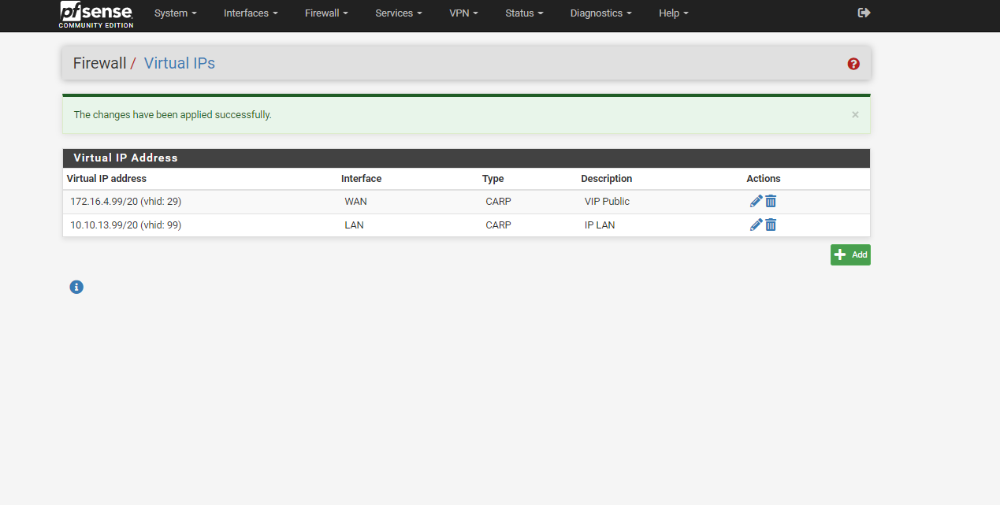

# Hướng dẫn cấu hình cài đặt Pfsense HA

## Mục đích sử dụng
- Tăng khả năng ổn định, sẵn sàng cho dịch vụ cung cấp VPS của Pfsense. 
- trong trường 1 trong các node Pfsense gặp sự cố thì node còn lại vẫn đảm bảo hoạt động.

## Các Bước cầu hình
- `Cấu hình CARP` (Common Address Redundancy Protocol): Giao thức tạo VIP trên Pfsense
- `Pfsync` : Đồng bộ Firewall Pfsense
- `XMLRPC sync` : Đồng bộ cấu hình OpenVPN

*Lưu ý*: Các node pfSense phải có chung 1 `phiên bản`.

## Phần I. Mô Hình triền khai

### 1. Mô hình:
- Cài đặt 2 Node `pfSense01` và `pfSense02`: [Hướng dẫn cài đặt](https://github.com/thang290298/Network/blob/main/01-VPN/01-OpenVPN/02-Lab/01-Install-Pfsense.md)
- Mỗi Node Pfsense gồm 3 dải IP, trong đó:
  - `vtnet0`: Dải WAN, dải kết nối IP Public sử dụng để kết nối đến internet.
  - `vtnet1`: Dải LAN, dải kết nối các máy chủ nội bộ cấp VPN
  - `vtnet2`: Dải SYNC, dải đồng bộ dữ liệu giữ 2 Node Pfsense

### 2. Cấu hình IP của các Node pfSense

#### Bước 1: Cấu Hình IP trên Node pfSense01

- `vtnet0`: 172.16.4.29 - WAN
- `vtnet1`: 10.10.13.29 - LAN
- `vtnet2`: 10.10.11.29 - SYNC

#### Bước 2: Cấu Hình IP trên Node pfSense02

- `vtnet0`: 172.16.4.30 - WAN
- `vtnet1`: 10.10.13.30 - LAN
- `vtnet2`: 10.10.11.30 - SYNC

## Phần II. Cấu hình pfSync
###  Bước 1:  Cấu hình Rule cho Interface SYNC
`Interface SYNC` là interface sử dụng để Pfsense đồng bộ dữ liệu giữa các node Pfsense

*Lưu ý* thực hiện trên cả 2 node Pfsense

- Cấu hình `Allow All` trên `Interface SYNC`
- Chọn `Firewall > Rules > add`

- Tại mục: `Edit Firewall Rule`
  - Action: `Pass`
  - Interface: `SYNC`
  - Address Family: `IPv4`
  - Protocol: `any`
  - bấm `Save` > `Apply change` để lưu cấu hình cài đặt

### Bước 2: Cấu hình High Availability trên node Master

Thực hiện trên node `HA-Pfsense01`

Chọn `System` > `High Avail. Sync`

- Tại: `State Synchronization Settings (pfsync)`
  - `Synchronize states`: Tick chọn `pfsync transfers state insertion, update, and deletion messages between firewalls.`
  - `Synchronize Interface`: chọn `SYNC`
  - `pfsync Synchronize Peer IP`: `10.10.11.30` (IP Sync của HA-pfSense02)

- Ở mục `Configuration Synchronization Settings (XMLRPC Sync)`
  - `Synchronize Config to IP`: `10.10.11.30` (IP Sync của HA-pfSense02)
  - `Remote System Username` : admin (Tài khoản truy cập HA-pfSense02)
  - `Remote System Password`: Điền thông tin `mật khẩu` tài khoản `admin` trên node `HA-pfSense02`
  - Chọn `Toggle All` sau đó `save`

### Bước 3: Cấu hình High Availability trên node Backup

Thực hiện trên node `HA-Pfsense02`

Chọn `System > High Avail. Sync`

- Tại: `State Synchronization Settings (pfsync)`
  - `Synchronize states`: Tick chọn `pfsync transfers state insertion, update, and deletion messages between firewalls.`
  - `Synchronize Interface`: chọn `SYNC`
  - `pfsync Synchronize Peer IP`: `10.10.11.29` (IP Sync của HA-pfSense01)

*Lưu ý:* Noded Backup bỏ qua cấu hình Configuration Synchronization Settings (XMLRPC Sync)

### Bước 3: Kiểm tra đồng bộ

Thực hiện trên node `HA-Pfsense01`

Chọn `Firewall` > `Aliases`

- Nhập `name` tùy chọn sau đó chọn `save` và `apply change` để lưu cấu hình

Kiểm tra trên Node `HA-pfSense02`:

*Lưu ý:* 
  - Nếu cấu hình đúng, sau khi config Firewall, VPN trên node HA-pfsense01 các cấu hình sẽ auto đồng bộ sang node HA-pfsense02.
  - trong trường hợp cấu hình sai, kiểm tra cấu hình Firewall interface SYNC, hoặc kiểm tra log hệ thống

## Phần III. Cấu hình VIP trên 2 Node PFSENSE
Thực hiện trên node `HA-Pfsense01`

### Bước 1:  Cấu hình VIP cho đường WAN
- Chọn `Firewall` > `Virtual IPs` > `add`

- Điền các thông tin sau: 
  - `Type`: CARP
  - `Interface`: WAN
  - `VHID Group`: 29
  - `Description`: VIP Public
  - Bấm `save` và `Apply changes` để lưu cấu hình

*Lưu ý:* Chỉ cần cấu hình trên HA-pfsense01, config sẽ được đồng bộ sang HA-pfsense02
- Kiểm tra trên Node HA-pfsense02:

### Bước 2: Cấu hình VIP cho đường LAN
 
Cấu hình tương tư bước 1 đanh cho đường WAN với các thông số:
  - `Type`: CARP
  - `Interface`: LAN
  - `VHID Group`: 99
  - `Description`: VIP LAN
  - Bấm `save` và `Apply changes` để lưu cấu hình

### Bước 3: Kiểm tra trạng thái VIP

Thực hiện trên node `HA-Pfsense01`

Thực hiện trên node `HA-Pfsense02`

