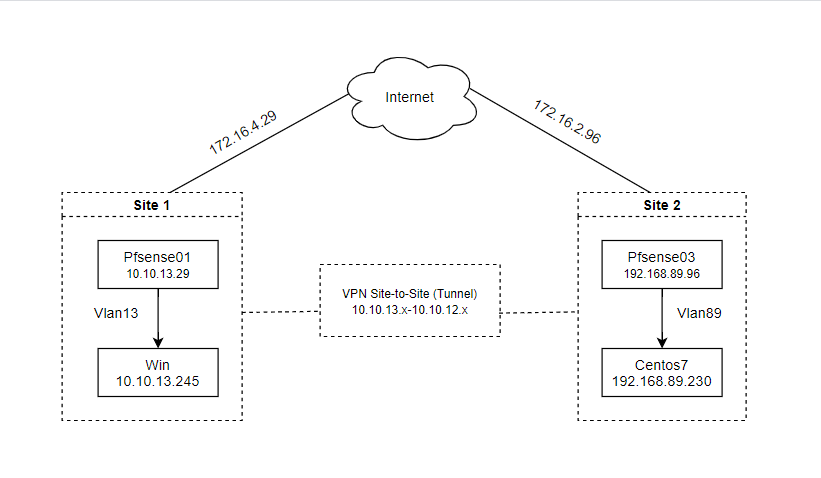
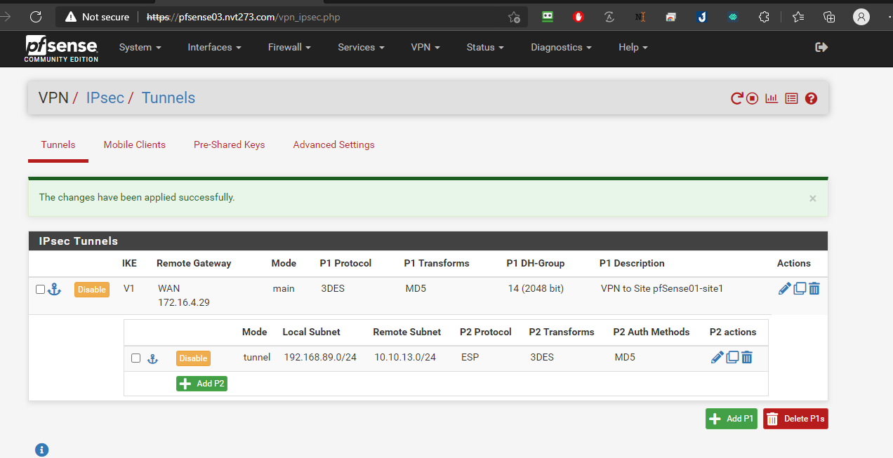
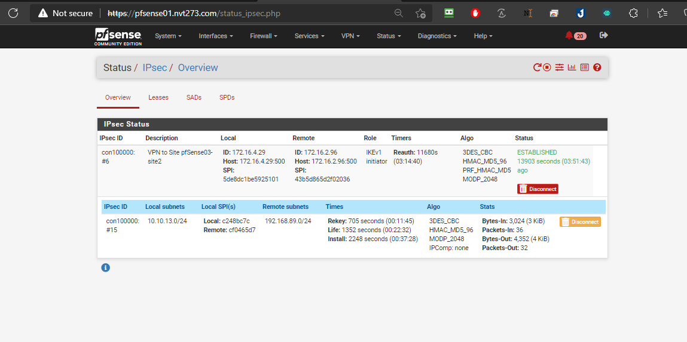

# Cấu hình Pfsense Site to Site (Không HA)
## Phần I. Mô hình hoạt động

### Chuẩn bị
#### 1. Cấu hình Site 1

- 1 máy chủ `Pfsense01`:
  - `vtnet0`: 172.16.4.29 - WAN IP Public
  - `vtnet1`: 10.10.13.29 - VLAN13 IP Private

- 1 Client Windown: IP 10.10.13.245

#### 2. Cấu hình Site 2

- 1 máy chủ `Pfsense03`:
  - `vtnet0`: 172.16.2.96 - WAN IP Public
  - `vtnet1`: 192.168.89.96 - VLAN89 IP Private
- 1 Client centos7: IP 192.168.89.230

## Phần II. Cấu hình VPN IPSec tại Site 1

#### Thực hiện trên Node `Pfsense01`:
### Bước 1: Thiết lập VPN Site to Site qua IPSec
- Chọn `VPN > IPsec > add`

- Tại mục `General Information`
  - `Key Exchange version`: `IKEv1`
  - `Internet Protocol`: `IPv4`
  - `Interface`: `WAN`
  - `Remote Gateway`: 172.16.2.96 - Địa chỉ Public pfSense03 - Site 2
  - `Description`: VPN to Site pfSense03-site2

- Tại mục `Phase 1 Proposal (Authentication)`
  - `Authentication Method`: `Mutual PSK`
  - `My identifier`: `My IP address`
  - `Peer identifier`: `Peer IP address`
  - Click vào Generate new Pres-Shared Key để sinh giá trị Pre-Shared Key (`e7bc15ffcb7238ae120255435efa9fbf1dd15d98ed48531d452e81c8`)

*LƯU Ý:* Cần lưu lại Pre-Shared Key này để copy sang pfsense-site02 (2 Site cần phải có key giống nhau)

- Tại mục `Phase 1 Proposal (Encryption Algorithm)`
  - Cấu hình Encryption Algorithm
    - `Algorithm - 3DES`
    - `Hash MD5`
    - `DH Group: 14 (2048 bit)`

Sau đó tiến hành `Save` và `Apply changes` lại.

- Chọn Show `Phase 2 Entries`

- Tại mục `General Information`
  - `Mode`: `Tunnel IPv4`
  - `Local Network`: Network - `10.10.13.0/24` - Dải địa chỉ VLAN13 tại Site 1
  - `NAT/BINAT translation`: None
  - `Remote Network`: Network - `192.168.89.0/24` - Dải địa chỉ VLAN89 tại Site 2
  - `Description`: VLAN13 to VLAN89

- Tại mục `Phase 2 Proposal (SA/Key Exchange)`
  - `Encryption Algorithms`: `3DES`
  - `Hash Algorithms`: `MD5`
  - `PFS key group`: `14 (2048 bit)`
- Tại mục `Expiration and Replacement`
  - `Lifetime`: `3600`
- Tại mục `Advanced Configuration`
  - `Automatically ping host`: 192.168.89.100 IP VLAN89 tại Site 2

- kết quả:

### Bước 2: Cấu hình Firewall cho VPN Site to Site tại interface WAN

- Chọn `Firewall > Rules`

- Tại mục `Edit Firewall Rule`
  - `Action`: `Pass`
  - `Interface`: `WAN`
  - `Address Family`: `IPv4`
  - `Protocol`: `TCP/UDP`
- Tại mục `Destination: Destination Port Range`
  - `From`: `IPsec NAT-T (4500)`
  - `To`: `IPsec NAT-T (4500)`
- Sau đó `Save` và ` Apply changes` lại.

Tiếp tục Add thêm Rule với config:
- Tại mục `Edit Firewall Rule`
  - `Action`: `Pass`
  - `Interfac`e: `WAN`
  - `Address Family`: `IPv4`
  - `Protocol`: `TCP/UDP`
- Tại mục `Destination`:
  - `Destination Port Range`:
    - From: `ISAKMP (500)`
    - To: `ISAKMP (500)`
- Chọn `Save` và `Apply Changes`

### Bước 3: Cấu hình Firewall cho VPN Site to Site tại interface IPsec

- Tại mục `Edit Firewall Rule`
  - `Action`: `Pass`
  - `Interface`: `IPSec`
  - `Address Family`: `IPv4`
  - `Protocol`: `Any`
- Tại mục `Source`:
  - `Source - Network - 192.168.89.0/24` - Cho phép dải VLAN41 được phép kết nối qua VPN IPsec
- Chọn `Save` và `Apply changes`

### Bước 4: Bước Kiểm tra trạng thái VPN Site to Site IPsec

Chọn `Status` > `IPsec`

Hiện tại chưa cấu hình trên Node Pfsense03 tại Site 2 nên `STATUS` có trạng thái `CONNECTING`

## Phần III. Cấu hình VPN IPSec tại Cụm 2

Thực hiện trên Node pfsense02 tại Site 2 ( Thực hiện cấu hình tương tự Node `Pfsense01` tại `Site 1`)

### Bước 1: Thiết lập VPN Site to Site qua IPSec

### Bước 2: Cấu hình Firewall cho VPN Site to Site tại interface WAN

### Bước 3: Cấu hình Firewall cho VPN Site to Site tại interface IPsec

## Phần IV. Kiểm tra kết nối giữa 2 Site

### Site 1: Pfsense01

- Ping từ client `Site 1` đến `Site 2`
  - `Client IP: 10.10.13.245` đến `Pfsense03 IP: 192.168.89.96`

### Site 2: Pfsense03

