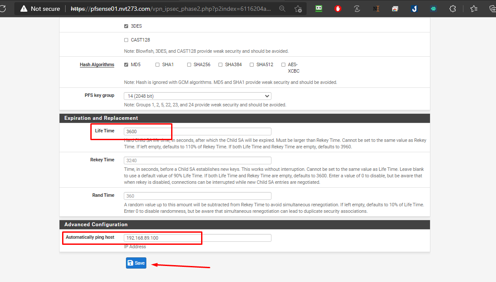

# Cấu hình Pfsense Site to Site (Không HA)
## Phần I. Mô hình hoạt động

### Chuẩn bị
#### 1. Cấu hình Site 1

- 1 máy chủ `Pfsense01`:
  - `vtnet0`: 172.16.4.29 - WAN IP Public
  - `vtnet1`: 10.10.13.29 - VLAN13 IP Private

- 1 Client Windown: IP 10.10.13.245

#### 2. Cấu hình Site 2

- 1 máy chủ `Pfsense03`:
  - `vtnet0`: 172.16.2.29 - WAN IP Public
  - `vtnet1`: 10.10.12.29 - VLAN12 IP Private
- 1 Client Windown: IP 10.10.12.245

