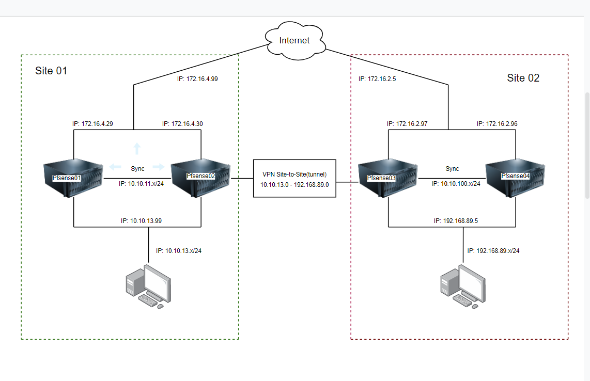

# 
Cấu hình Pfsense Site to Site mô Hình HA

## Phần I.Mô Hình triển khai và chuẩn bị 

### 1. Mô Hình

### 2. Chuẩn bị

#### Cấu hình Chung

- Cấu hình HA cho Pfsense đối với 2 cụm site 1 và site 2([Hướng dẫn tại đây](https://github.com/thang290298/Network/blob/main/01-VPN/01-OpenVPN/02-Lab/03-Pfsense-HA.md))
- Cấu hình Mode Tab VPN đối với 2 cụm Site 1 và Site 2([Hướng dẫn tại đây](https://github.com/thang290298/Network/blob/main/01-VPN/01-OpenVPN/02-Lab/02-Setup-OpenVPN-mode-Tab-connect.md))

#### Tại Site 1:

- VIP IP Public: 172.16.4.99
- VIP IP Private: 10.10.13.99
- Node Pfsense01:
  - IP Public: 172.16.4.29
  - IP Private: 10.10.13.29 - Vlan13
  - IP SYNC: 10.10.11.29 - Vlan 11

- Node Pfsense02:
  - IP Public: 172.16.4.30
  - IP Private: 10.10.13.30 - Vlan13
  - IP SYNC: 10.10.11.30 - Vlan 11

#### Tại Site 2:

- VIP IP Public: 172.16.2.5
- VIP IP Private: 192.168.89.5
- Node Pfsense01:
  - IP Public: 172.16.2.96
  - IP Private: 192.168.89.96 - Vlan89
  - IP SYNC: 10.10.100.10 - Vlan SYNC

- Node Pfsense02:
  - IP Public: 172.16.2.97
  - IP Private: 192.168.89.47 - Vlan89
  - IP SYNC: 10.10.100.11 - Vlan SYNC

## Phần 2: Cấu hình VPN IPSec

### Tại Site 1

#### Bước 1: Truy cập cấu hình tại VIP IP Public: 172.16.4.99 cấu hình IP SEC

- Truy cập theo theo đường dẫn `VPN`>`IPsec` chọn `add P1` và điển thông tin cấu hình như sau để cấu hình IPsec:
  -  Tại mục `General Information`:
     - `Key Exchange version`: IKEv1
     - `Internet Protoco`l: IPv4
     - `Interface`: `172.16.4.99` (Site01-VIP) - Đây là địa chỉ VIP IP Public của Site 1
     - `Remote Gateway`: 172.16.2.5 - VIP IP Public của Site 2
     - `Description`: VPN Site1-to-Site2 HA

  - Tại mục `Phase 1 Proposal (Authentication)`:
     - `Authentication Method`: Mutual PSK
     - `Negotiation mode`: Main
     - `My identifier`: My IP address
     - `Peer identifie`r: Peer IP address
     - Click vào Generate new Pres-Shared Key để sinh giá trị Pre-Shared Key:` 30e9231985436bc89a41165487e3036c13894c42c203bc602b930fe5 `

*LƯU Ý:* Cần lưu lại Pre-Shared Key này để copy sang Site 2 (2 Site cần phải có key giống nhau)

  - Tại mục `Phase 1 Proposal (Encryption Algorithm)`:
     - `Algorithm`: 3DES
     - `Hash`: MD5
     - `DH Group`: 14 (2048 bit)

  - Chọn `Save` sau đó `Apply Changes` để áp dụng cấu hình

- Chọn Show Phase 2 Entries và tiến hành chọn `Add P2` để cấu hình IPsec tunnel cho dải vlan Private:

( ở đây do đã cấu hình cài đặt từ trước nên đã có sẵn)

  - Tại mục `General Information`
     - `Mode`: Tunnel IPv4
     - `Local Network` : 10.10.13.0 - Vlan13 Site 1
     - `NAT/BINAT translation`: None
     - `Remote Network`: 192.168.89.0 - Vlan89 Site 2
     - `Description`: Site1-to-Site2

  - Tại mục `Phase 2 Proposal (SA/Key Exchange)`
     - `Encryption Algorithms`: 3DES
     - `Hash Algorithms`: MD5
     - PFS key group`: 14 (2048 bit)
  - Tại mục `Expiration and Replacement`
     - `Lifetime`: 3600
  - Tại mục `Advanced Configuration`
     - `Automatically ping host`: 192.168.89.96 - IP Vlan89 Site 2
  - Chọn `Save` sau đó `Apply Changes` để áp dụng cấu hình

- Kết quả:

#### Bước 2: Cấu hình Firewall tại interface WAN

- Truy cập theo theo đường dẫn `Firewall` > `Rules` chọn `Add` để thêm rule trên cổng WAN:
  - Tại mục `Edit Firewall Rule`
     - `Action`: Pass
     - `Interface`: WAN
     - `Address Family`: IPv4
     - `Protocol`: TCP/UDP
  - Tại mục `Destination: Destination Port Range`
     - `From`: IPsec NAT-T (4500)
     - `To`: IPsec NAT-T (4500)
  - Chọn `Save` sau đó `Apply Changes` để áp dụng cấu hình

Tiếp tục Add thêm rule: 

  - Tại mục `Edit Firewall Rule`
     - `Action`: Pass
     - `Interface`: WAN
     - `Address Family`: IPv4
     - `Protocol`: TCP/UDP
  - Tại mục `Destination: Destination Port Range`
     - `From`: ISAKMP (500)
     - `To`: ISAKMP (500)
  - Chọn `Save` sau đó `Apply Changes` để áp dụng cấu hình

#### Bước 3: Cấu hình Firewall tại interface IPsec

- Truy cập theo theo đường dẫn `Firewall` > `Rules` chọn `Add` để thêm rule trên cổng IPsec:
  - Tại mục `Edit Firewall Rule`
     - `Action`: Pass
     - `Interface`: IPSec
     - `Address Family`: IPv4
     - `Protocol`: Any
  - Tại mục `Source`
     - `Source - Network`: 192.168.89.0/24 Dải Vlan89 tại Site 2
  - Chọn `Save` sau đó `Apply Changes` để áp dụng cấu hình

### Tại Site 2

Thực hiện cấu hình Tương tự đối với Site 1 và thay đổi các cấu hình thông số tương ứng cần thiết

#### Bước 1: Truy cập cấu hình tại VIP IP Public: 172.16.2.5 cấu hình IP SEC

Truy cập theo theo đường dẫn `VPN`>`IPsec` chọn `Add` tiến hành cấu hình:

- Kết quả sau khi cấu hình: 

#### Bước 2: Cấu hình Firewall tại interface WAN và IPsec tại Site 2

- Add `Rules` cấu hình Firewall tương tự đố với Site 2
  - WAN:

  - IPsec:

## Phần 3: kiểm tra khả năng kết nối sau khi cấu hình

### Lần 1: Cả 4 Node Pfsene Online

### Lần 2: Node Pfsense01 tại Site 1 và Node Pfsense03 tại Site 2 Off

